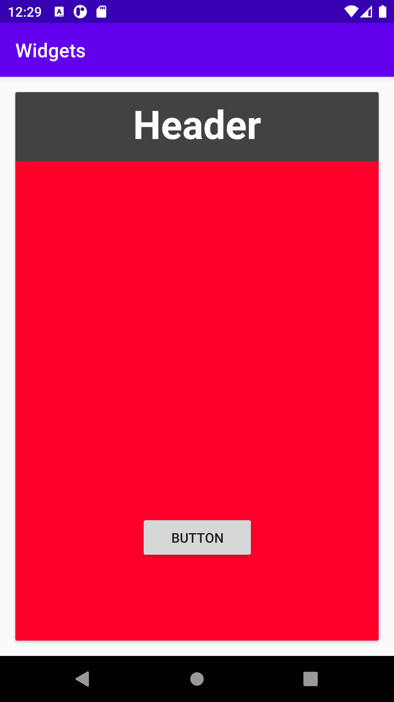

# Rapport

**Jag adderat cardview med tre constraintlayout Första är TextView viktiga saker jag lagt till Layout_margin , gravity center så att min text står i centrum. Andra constraintlayout är imageView, och sista är button och använder layout_marginTop, layout_marginLeft och gravity att sätta i centrum.  **

_Du kan ta bort all text som finns sedan tidigare_.

## Följande grundsyn gäller dugga-svar:

- Ett kortfattat svar är att föredra. Svar som är längre än en sida text (skärmdumpar och programkod exkluderat) är onödigt långt.
- Svaret skall ha minst en snutt programkod.
- Svaret skall inkludera en kort övergripande förklarande text som redogör för vad respektive snutt programkod gör eller som svarar på annan teorifråga.
- Svaret skall ha minst en skärmdump. Skärmdumpar skall illustrera exekvering av relevant programkod. Eventuell text i skärmdumpar måste vara läsbar.
- I de fall detta efterfrågas, dela upp delar av ditt svar i för- och nackdelar. Dina för- respektive nackdelar skall vara i form av punktlistor med kortare stycken (3-4 meningar).

Programkod ska se ut som exemplet nedan. Koden måste vara korrekt indenterad då den blir lättare att läsa vilket gör det lättare att hitta syntaktiska fel.

```
<androidx.cardview.widget.CardView
        android:layout_width="match_parent"
        android:layout_height="wrap_content"
        app:layout_constraintTop_toTopOf="parent"
        app:layout_constraintStart_toStartOf="parent"
        android:layout_margin="16dp"
        app:cardBackgroundColor="#ff002b"


        >

        <androidx.constraintlayout.widget.ConstraintLayout
            android:id="@+id/card_title"
            android:layout_width="match_parent"
            android:layout_height="72dp"
            android:background="@color/cardview_dark_background">


            <TextView
                android:id="@+id/textView"
                android:layout_width="match_parent"
                android:layout_height="wrap_content"
                android:layout_marginTop="5dp"
                android:gravity="center"
                android:text="Header"
                android:textColor="#fefefe"
                android:textSize="41dp"
                android:textStyle="bold"
                app:layout_constraintStart_toStartOf="parent"
                app:layout_constraintTop_toTopOf="parent"


                tools:ignore="MissingConstraints" />

        </androidx.constraintlayout.widget.ConstraintLayout>

        <androidx.constraintlayout.widget.ConstraintLayout
            android:layout_width="match_parent"
            android:layout_height="300dp"
            android:layout_marginTop="100dp">


            <ImageView
                android:id="@+id/imageView"
                android:layout_width="wrap_content"
                android:layout_height="wrap_content"
                android:layout_marginTop="0dp"
                android:scaleType="center"
                app:layout_constraintStart_toStartOf="parent"
                app:layout_constraintTop_toTopOf="parent"
                tools:srcCompat="@tools:sample/backgrounds/scenic"
                tools:ignore="MissingConstraints"


                />


        </androidx.constraintlayout.widget.ConstraintLayout>

        <androidx.constraintlayout.widget.ConstraintLayout
            android:layout_width="match_parent"
            android:layout_height="100dp"
            android:layout_marginTop="430dp">


            <Button
                android:id="@+id/button"
                android:layout_width="120dp"
                android:layout_height="wrap_content"
                android:layout_marginTop="10dp"
                android:layout_marginLeft="130dp"
                android:gravity="center"
                android:text="Button"
                app:layout_constraintStart_toStartOf="parent"
                app:layout_constraintTop_toTopOf="parent"

                tools:ignore="MissingConstraints"

                />
        </androidx.constraintlayout.widget.ConstraintLayout>


    </androidx.cardview.widget.CardView>
```

Bilder läggs i samma mapp som markdown-filen.



Läs gärna:

- Boulos, M.N.K., Warren, J., Gong, J. & Yue, P. (2010) Web GIS in practice VIII: HTML5 and the canvas element for interactive online mapping. International journal of health geographics 9, 14. Shin, Y. &
- Wunsche, B.C. (2013) A smartphone-based golf simulation exercise game for supporting arthritis patients. 2013 28th International Conference of Image and Vision Computing New Zealand (IVCNZ), IEEE, pp. 459–464.
- Wohlin, C., Runeson, P., Höst, M., Ohlsson, M.C., Regnell, B., Wesslén, A. (2012) Experimentation in Software Engineering, Berlin, Heidelberg: Springer Berlin Heidelberg.
